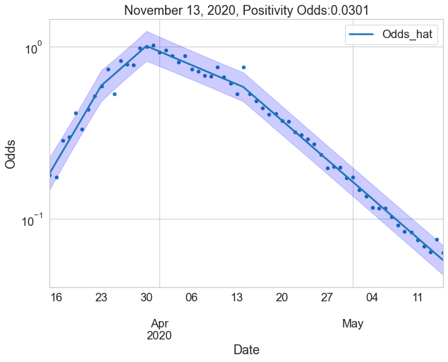

# Masks and COVID-19: a causal framework for imputing value to public-health interventions
> Code to reproduce <a href='https://arxiv.org/abs/2006.05532'>Masks and COVID-19</a>.


This is a refactored version of the original [code](https://github.com/ababino/corona). 

## Install

`pip install babino2020masks`

## Positivity Odds in NYS

```python
ny = NYSAPI()
df = ny.get_all_data_state_wide()
```

```python
ax = df.plot.scatter(x='Date', y='Odds', figsize=(10, 7), logy=True);
ax.set_title(f'{df.tail(1).Date[0]:%B %d, %Y}, Positivity Odds:{df.tail(1).Odds[0]:2.3}');
```




